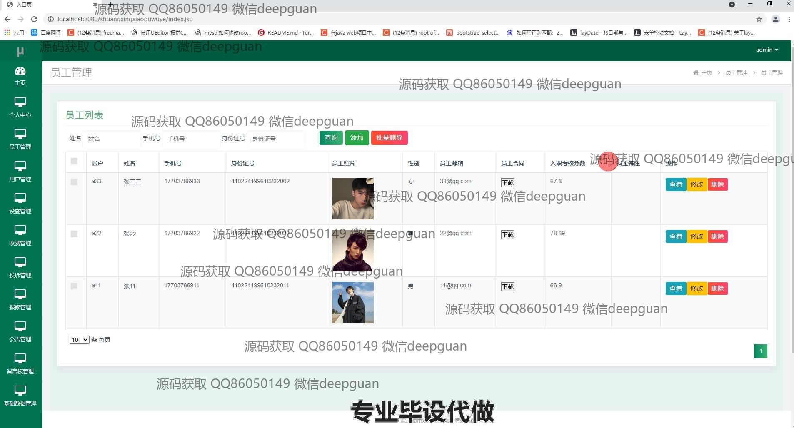
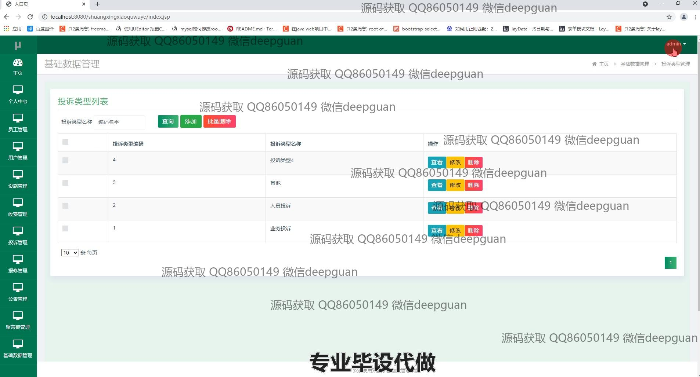
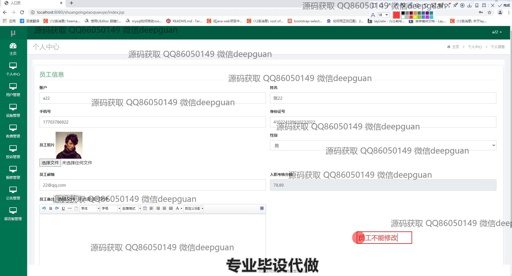

<h1 align="center">双星小区物业管理系统的设计与实现</h1>

## 简介
双星小区物业管理系统：角色分为管理员、用户；功能包括员工管理、用户管理、设备管理、收费管理、投诉管理、报修管理、公告管理、留言板管理。系统旨在提高物业管理效率，优化用户体验。    --计算机毕业设计源码；毕设源码；java毕业设计源码

## 联系方式

<h3 align="center">获取完整代码与数据库文件 + 微信：deepguan QQ: 86050149 QQ群: 783742310</h3>

<h3 align="center">可帮忙远程部署 包运行成功！提供远程部署、修改代码、设计文档指导、代码讲解等服务！</h3>

## 功能介绍（完整见运行截图）
管理员：管理员可以高效管理双星小区物业管理系统中的员工信息、用户数据、设备和收费信息。可以访问主页、个人中心、员工管理、用户管理、设备管理、报修管理、投诉管理、公告管理和留言板管理等模块。管理员有权限进行员工的查看、修改、删除、添加和合同管理，以及用户注册信息的审批和处理。对于报修和投诉，管理员能够查看详细信息并处理请求，并维护公告内容和系统留言类型。另外，管理员还可以管理和调整用户和设备的信息，包括新增或编辑设备与设施的基本数据。

工作人员：作为系统用户，工作人员需要进行多项日常维护任务，包括处理用户的报修请求和投诉管理。工作界面上显示用户相关的基本信息，如姓名和联系方式，以及具体的报修内容、时间和状态，帮助工作人员进行高效处理。此外，工作人员还可以管理员工的入职考核、上传相关文件和处理合同事务。工作中涉及到对设施的管理和维护、查询设备的购买和使用状态，以及管理系统中的公告信息。

用户：用户可以通过系统进行物业报修、投诉和反馈，界面友好且操作简便。个人中心允许用户查看和更新自己的基本信息，包括账户信息、联系方式和用户照片。用户可以查询已提交的报修项目的状态，提交新的投诉并附带相关文件。支持注册新账户，用户能够填写必要信息如身份证号、邮箱并上传头像。用户还可以浏览和查询小区公告和留言板，与物业相关方沟通并反馈意见。

访客：访客使用该系统的注册功能，填写必要的注册信息，包括身份证号和邮箱，并上传个人头像以完成注册。系统为访客提供了选择性别、输入邮箱和其他个人信息的界面。访客一旦注册成为用户，即可使用系统提供的全部功能，包括查看公告，发布留言，以及与物业团队沟通与反馈。在注册界面完成信息录入后，系统会引导航客在不同的功能模块间进行操作。

## 运行截图

本代码来源于网络,仅供学习参考使用!

